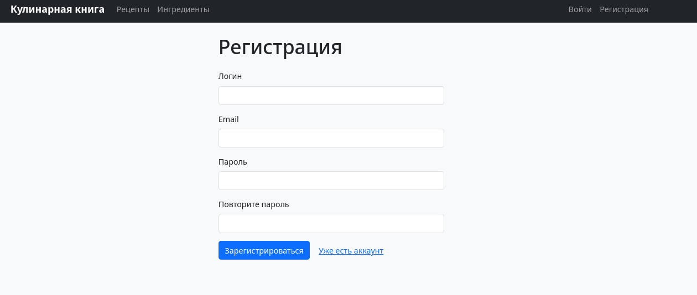
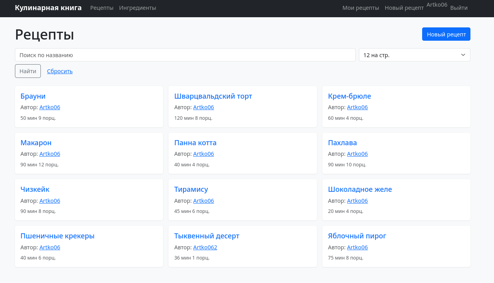
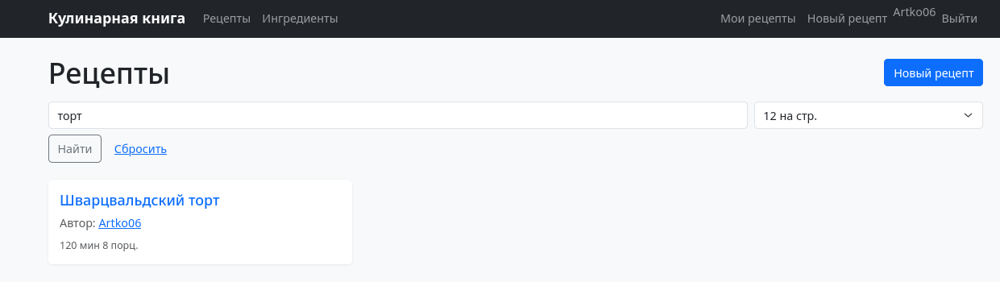
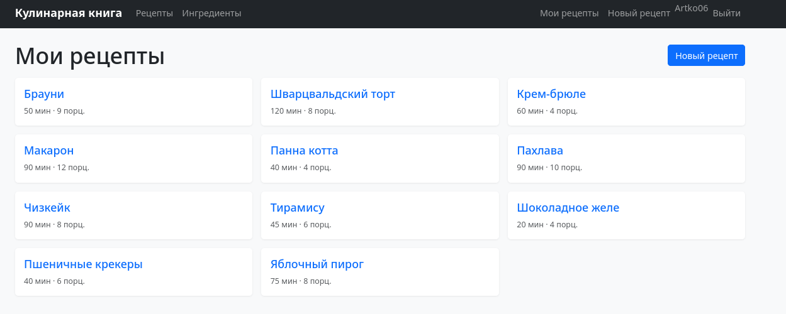
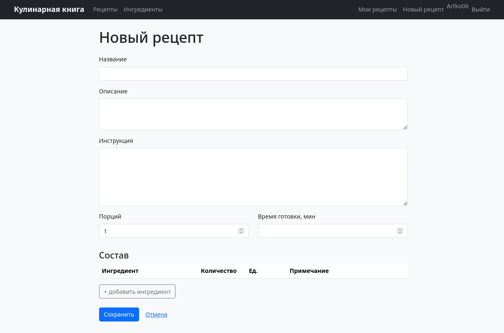
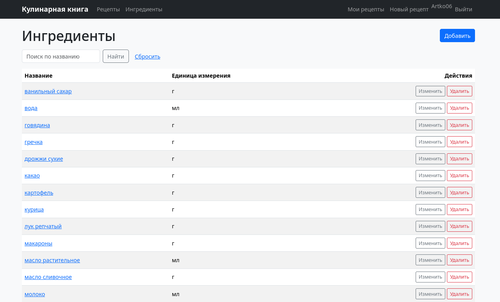

# Отчёт по приложению «Кулинарная книга»

## 1. Доменная область приложения

**Кулинарная книга сообщества** — клиент-серверное веб-приложение, в котором
пользователи публикуют рецепты и просматривают рецепты друг друга. Редактировать и
удалять рецепт может только его автор; справочник ингредиентов общий.

**Роли:**
- **Гость** — просматривает рецепты, ингредиенты, страницы авторов, ищет рецепты по названию.
- **Пользователь** — дополнительно создаёт рецепты и управляет только своими.

**Ключевые сценарии:**
- лента рецептов с поиском по названию и пагинацией;
- регистрация, вход, выход;
- создание, просмотр, редактирование и удаление своих рецептов (с составом);
- просмотр страницы автора и его рецептов;
- ведение общего справочника ингредиентов.

Приложение разделено на фронтенд (серверный рендеринг HTML) и бэкенд (HTTP-обработчики,
бизнес-логика, доступ к данным). Над сущностями реализованы **CRUD-операции**:
- рецепты — создание, чтение, изменение, удаление (изменение/удаление только автором);
- ингредиенты — создание, чтение, изменение, удаление (удаление запрещено, если ингредиент
  используется в рецептах).

## 2. Стек реализации

| Слой | Технология |
|------|-----------|
| Язык | Java 21 |
| Фреймворк | Spring Boot 4.1.1 |
| Фронтенд | Thymeleaf + Bootstrap 5 |
| Бэкенд | Spring MVC |
| Сборка | Gradle (Kotlin DSL) |
| БД | PostgreSQL 16 |
| Доступ к данным | Spring Data JPA (Hibernate) |
| Миграции | Flyway |
| Аутентификация | Spring Security (form login), BCrypt |
| Сессии | Spring Session JDBC (хранение в PostgreSQL) |
| Контейнеризация | Docker (multi-stage), docker-compose |

## 3. Основные сущности доменной области

### User → users

| Поле | Тип | Ограничения |
|------|-----|-------------|
| id | BIGSERIAL | PK |
| username | VARCHAR(50) | UNIQUE, NOT NULL |
| email | VARCHAR(120) | UNIQUE, NOT NULL |
| password_hash | VARCHAR(255) | NOT NULL (BCrypt) |

### Ingredient → ingredients

Общий справочник ингредиентов.

| Поле | Тип | Ограничения |
|------|-----|-------------|
| id | BIGSERIAL | PK |
| name | VARCHAR(100) | UNIQUE, NOT NULL |
| unit | VARCHAR(20) | NOT NULL |

### Recipe → recipes

| Поле | Тип | Ограничения |
|------|-----|-------------|
| id | BIGSERIAL | PK |
| title | VARCHAR(150) | NOT NULL |
| description | TEXT | |
| instructions | TEXT | |
| servings | INT | NOT NULL, DEFAULT 1 |
| cooking_time_min | INT | nullable |
| author_id | BIGINT | FK → users(id), NOT NULL, ON DELETE CASCADE |

### RecipeIngredient → recipe_ingredient

Состав рецепта — связь M:N между `Recipe` и `Ingredient` с атрибутами.

| Поле | Тип | Ограничения |
|------|-----|-------------|
| id | BIGSERIAL | PK |
| recipe_id | BIGINT | FK → recipes(id), NOT NULL, ON DELETE CASCADE |
| ingredient_id | BIGINT | FK → ingredients(id), NOT NULL, ON DELETE RESTRICT |
| quantity | NUMERIC(10,2) | NOT NULL |
| unit | VARCHAR(20) | nullable |
| note | VARCHAR(255) | nullable |

Составной уникальный ключ: `UNIQUE (recipe_id, ingredient_id)`.

**Связи:**

```
User  1 ──< Recipe
Recipe 1 ──< RecipeIngredient >── 1 Ingredient
```

Схема создаётся миграциями Flyway (`V1__init.sql`, `V2__seed_ingredients.sql`);
таблицы сессий создаёт Spring Session JDBC.

## 4. Аргументация соответствия 12 факторам

| № | Фактор | Реализация                                                                                       |
|---|--------|--------------------------------------------------------------------------------------------------|
| I | Codebase | Одно приложение в одном git-репозитории (https://github.com/Artko06/Cookbook)                                                |
| II | Dependencies | Зависимости объявлены явно в `build.gradle.kts`, версии — из BOM Spring Boot                     |
| III | Config | Конфигурация через переменные окружения (`DB_URL`, `DB_USER`, `DB_PASSWORD`, `SERVER_PORT`, `LOG_LEVEL`); секретов в коде нет |
| IV | Backing services | PostgreSQL подключается по URL из env как внешний ресурс; сессии также хранятся в БД, а не в памяти |
| V | Build/Release/Run | Разделены: сборка (`./gradlew bootJar`) → образ/артефакт → запуск (`java -jar`); в Dockerfile отдельные стадии build и run |
| VI | Processes | Приложение stateless: состояние — только в PostgreSQL (данные и сессии), in-memory состояния нет |
| VII | Port binding | Порт задаётся переменной `SERVER_PORT`; встроенный Tomcat слушает его, приложение самодостаточно |
| VIII | Concurrency | Несколько экземпляров приложения могут работать за балансировщиком; общая БД и общие сессии в БД |
| IX | Disposability | Быстрый старт; корректное завершение по `SIGTERM` (`STOPSIGNAL SIGTERM`, `server.shutdown=graceful`) |
| X | Dev/prod parity | Одинаковый `postgres:16` в dev и prod, одни и те же миграции Flyway                              |
| XI | Logs | Logback пишет в stdout; файловых логов нет                                                       |
| XII | Admin processes | Схема версионируется Flyway; миграции применяются как отдельный административный шаг при старте/релизе |

## 5. Интерфейс приложения

Ниже — основные экраны приложения.

### Вход


Страница входа (`/login`): поля «Логин» и «Пароль», кнопка «Войти» и ссылка на регистрацию.

### Регистрация


Форма регистрации (`/register`): логин, email, пароль и его подтверждение. После успешной
регистрации выполняется автоматический вход.

### Лента рецептов


Главная страница (`/`): лента всех рецептов с поиском по названию и выбором числа записей
на странице. В карточке — название, автор, время готовки и число порций.

### Поиск по названию


Работа поиска: введён запрос «торт» — в ленте остаётся только подходящий рецепт.

### Мои рецепты


Страница `/recipes/my`: рецепты текущего пользователя.

### Создание рецепта


Форма создания/редактирования рецепта (`/recipes/new`): название, описание, инструкция,
порции, время готовки и динамический состав (ингредиент, количество, единица измерения,
примечание; строки добавляются и удаляются).

### Справочник ингредиентов


Страница `/ingredients`: список ингредиентов с поиском; для вошедших пользователей доступны
действия «Изменить» и «Удалить».

